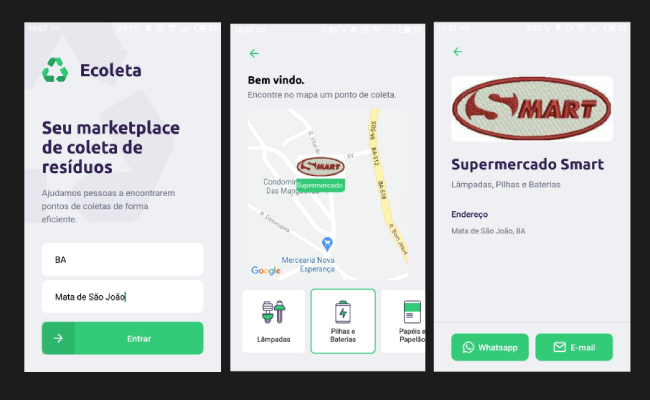

[](https://github.com/dyhalmeida)
[](#)

<h3 align="center"><strong>E-coleta</strong> is a project developed based on international environment week. That aims to connect people to companies that collect specific waste such as light bulbs, batteries, cooking oil, etc.</h3>

<div align="center" >
  
</div>

## 📑 Technologies and modules used

This project was developed with the following technologies:

- ✔️ [React Native](https://reactnative.dev/)
- ✔️ [React Native Maps](https://github.com/react-native-community/react-native-maps#readme)
- ✔️ [Expo](https://expo.io/)
- ✔️ [Axios](https://github.com/axios/axios#readme)
- ✔️ [Typescript](https://www.typescriptlang.org/)

## 📍 Features

- ✔️ Filter collection points by uf and city
- ✔️ Filter collection point by recycling items
- ✔️ View collection points on the map
- ✔️ View collection point details
- ✔️ Send email through deep links
- ✔️ Send message by whatsapp with deep link

## 🚀 Getting Started

### 💻 Clone the repository

```bash
git clone https://github.com/dyhalmeida/ecoleta-mobile
```

### 💻 Installation

```bash
# In the project folder run
npm install
```

### 💻 Start Ecoleta mobile

```bash
# In the project folder run
npm start

# If some problem with fonts, execute:
expo install expo-font @expo-google-fonts/ubuntu @expo-google-fonts/roboto
```

## 🔓 License

MIT © [Diego Almeida](https://www.linkedin.com/in/dyhalmeida/)
